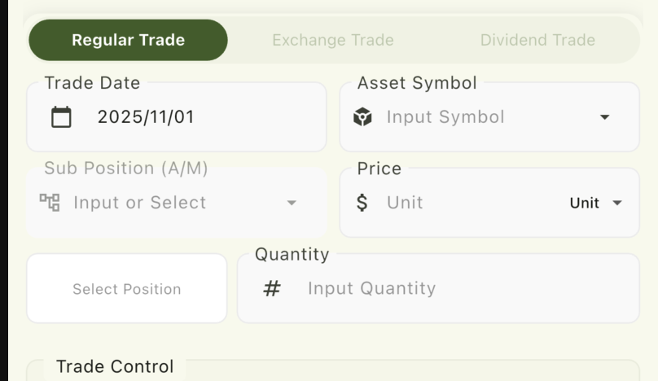
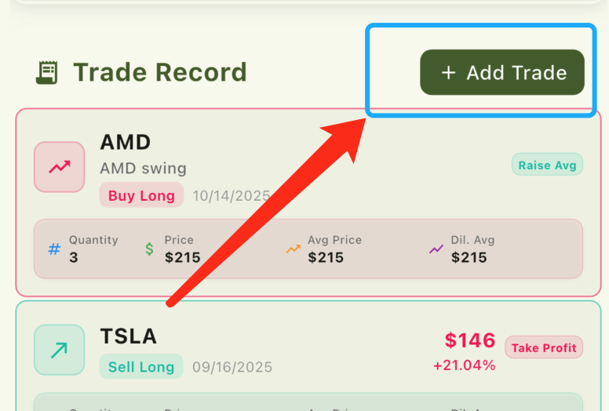

# 帮助与支持

> 查找常见问题的答案，获取您需要的帮助

---

## 快速帮助分类

### 快速入门
学习 TradeFlex 的基础知识

### 交易记录
管理您的交易和数据

### 设置
自定义您的使用体验

### 故障排除
解决常见问题

---

## 快速入门

### 可不可以自动导入券商的交易记录？

很抱歉，TradeFlex 不支持自动导入券商的交易记录。这是基于以下几个重要原因：

#### 隐私保护优先
- TradeFlex 采用**纯本地存储**，所有数据都保存在您的设备上
- 我们**不会联网读取**任何券商数据或用户交易信息
- 您的交易隐私得到最大程度的保护

#### 设计理念
- **手动记录交易本身就是一种复盘过程**
- 在记录过程中，您会重新思考交易决策和结果
- 这种主动参与有助于提升交易技能和风险意识

> **提示：** 将记录交易视为交易流程的一部分，这样既能保护隐私，又能促进交易技能的提升。

### 如何快速记录我的第一笔交易记录？

#### 在快速记录区域，可以以最短的时间记录一笔交易

1. 打开 TradeFlex，找到快速记录区域（如上图）
2. 选择交易日期（默认为今天日期）
3. 输入资产代码（如 AAPL、BTC）
4. 输入价格（单价或总价）
5. 输入数量
6. 点击交易执行按钮（如：买入，卖出）

> **提示：** 子持仓为选填项目，如果不主动填写的话，TradeFlex将会自动为您创建一个与资产名称同名的子持仓，为默认子持仓。

#### 如果希望详细记录一笔交易，则可以点击添加交易按钮

1. 在交易记录区域找到并点击 **"+"** 按钮
2. 选择 **"交易类型"**
3. 输入交易详情（代码、数量、价格、日期）
4. 添加详细内容，如标签，备注等
6. 点击 **"添加交易"** 记录交易

---

### 记录交易需要哪些信息？

#### 必需信息：
- 交易日期（APP会自动填入今天的日期）
- 资产代码（如 AAPL、BTC）
- 交易数量
- 单价/总价

#### 可选信息：
- 子持仓（如果留空则会创建一个和资产代码同名的子持仓）
- 交易时主观的恐惧贪婪指数
- 备注信息
- 自定义标签
---

## 交易记录管理

### 添加后可以编辑或删除交易吗？

是的，您可以随时修改您的交易：

#### 编辑交易：
1. 在交易列表中找到交易
2. 点击交易打开详情
3. 点击 **"编辑"** 按钮
4. 进行更改并保存

#### 删除交易：
1. 打开交易详情
2. 点击 **"删除"** 按钮
3. 确认删除

> 注意：除非您有备份，否则已删除的交易无法恢复。

---

## 分析与报告

### 盈亏是如何计算的？

TradeFlex 使用先进先出（FIFO）方法计算盈亏：

**示例：**
- **买入：** 100股苹果股票 @ $150 = $15,000
- **卖出：** 50股苹果股票 @ $160 = $8,000
- **利润：** (160 - 150) × 50 = $500

---

### 均价是如何计算的？

TradeFlex 使用加权平均成本法计算持仓的均价：

#### 计算方法：
均价 = 总成本 ÷ 总持仓数量

#### 示例计算：
**第一次买入：**
- 100股苹果股票 @ $150 = $15,000
- 当前均价：$150

**第二次买入：**
- 50股苹果股票 @ $180 = $9,000
- 总成本：$15,000 + $9,000 = $24,000
- 总股数：100 + 50 = 150股
- 新均价：$24,000 ÷ 150 = $160

**部分卖出后：**
- 卖出30股 @ $170
- 剩余股数：150 - 30 = 120股
- 均价保持：$160（不变）

#### 重要说明：
- 均价只在买入时重新计算
- 卖出操作不会改变剩余持仓的均价

---

### 摊薄均价是如何计算的？

TradeFlex 使用摊薄均价来反映考虑手续费、盈亏和股息后的真实持仓成本。摊薄均价会在每次买入、卖出、股息等操作后重新计算。

#### 计算方法：

摊薄均价考虑了以下因素：
- **手续费**：交易产生的成本
- **盈亏**：已实现的盈亏金额
- **股息**：收到的股息收入

#### 做多（买入）操作：

**首次买入：**
- 摊薄均价 = (数量 × 价格 + 手续费) ÷ 数量

**再次买入（加仓）：**
- 新摊薄均价 = (总数量 × 新均价 - (累计盈利 + 累计股息 - 累计手续费)) ÷ 总数量

**示例计算：**
**第一次买入：**
- 100股苹果股票 @ $150，手续费 $5
- 摊薄均价 = (100 × 150 + 5) ÷ 100 = $150.05

**第二次买入（加仓）：**
- 50股苹果股票 @ $180，手续费 $3
- 当前均价 = (100 × 150 + 50 × 180) ÷ 150 = $160
- 累计盈利 = $0，累计股息 = $0，累计手续费 = $8
- 新摊薄均价 = (150 × 160 - (0 + 0 - 8)) ÷ 150 = $160.05

**部分卖出后：**
- 卖出30股 @ $170，实现盈利 $300，手续费 $2
- 剩余数量 = 120股
- 累计盈利 = $300，累计股息 = $0，累计手续费 = $10
- 新摊薄均价 = (120 × 160 - (300 + 0 - 10)) ÷ 120 = $159.75

**收到股息后：**
- 收到股息 $50
- 累计盈利 = $300，累计股息 = $50，累计手续费 = $10
- 新摊薄均价 = (120 × 160 - (300 + 50 - 10)) ÷ 120 = $159.33

#### 做空（卖出开空）操作：

**首次做空：**
- 摊薄均价 = (数量 × 价格 - 手续费) ÷ 数量

**再次做空（加仓）：**
- 新摊薄均价 = (总数量 × 新均价 + (累计盈利 + 累计股息 - 累计手续费)) ÷ 总数量

**示例计算：**
**第一次做空：**
- 100股苹果股票 @ $150，手续费 $5
- 摊薄均价 = (100 × 150 - 5) ÷ 100 = $149.95

**部分平仓后：**
- 买入平仓30股 @ $140，实现盈利 $300，手续费 $2
- 剩余数量 = 70股
- 累计盈利 = $300，累计股息 = $0，累计手续费 = $7
- 新摊薄均价 = (70 × 150 + (300 + 0 - 7)) ÷ 70 = $154.19

#### 重要说明：

- **摊薄均价与均价的区别**：
  - 均价只考虑买入价格和数量
  - 摊薄均价考虑了手续费、盈亏和股息，更能反映真实成本

- **做多与做空的区别**：
  - 做多时，盈利和股息会降低摊薄均价（收回成本）
  - 做空时，盈利和股息会提高摊薄均价（反映成本变化）

- **摊薄均价的意义**：
  - 帮助您更准确地评估持仓的真实成本
  - 在做T（部分买卖）时，能更好地反映剩余持仓的成本变化
  - 考虑了所有交易成本，包括手续费和已实现盈亏

---

### 可以导出税务报告吗？

目前暂不支持税务报告导出功能，但我们计划在未来的版本中添加此功能。

#### 计划中的功能：
- PDF报告
- Excel电子表格
- CSV文件
- 税务专用模板

#### 将包含的报告类型：
- 已实现收益/损失
- 未实现持仓
- 股息收入
- 交易摘要

> **重要提示：** 对于具体的税务建议，请务必咨询税务专业人士。

## 故障排除

### 应用运行缓慢或崩溃

尝试以下故障排除步骤：

#### 快速修复：
1. 强制关闭并重启应用
2. 重启您的设备
3. 检查应用更新
4. 释放设备存储空间

#### 高级解决方案：
1. 清除应用缓存（Android）
2. 重新安装应用
3. 检查设备兼容性
4. 联系支持并提供崩溃日志

> **重新安装前：** 请确保备份您的数据，以避免丢失交易记录。

---

### 如何备份和恢复我的数据？

通过定期备份保护您的交易数据：

#### 创建备份：
1. 前往 **设置 → 数据管理**
2. 点击 **"创建备份"**
3. 等待备份完成

#### 恢复数据：
1. 前往 **设置 → 备份与恢复**
2. 点击 **"从备份恢复"**
3. 选择您的备份文件
4. 确认恢复操作

---

## 联系支持

### 仍需要帮助？

找不到您要找的内容？我们的支持团队随时为您解决任何问题。

**联系方式：** [tradeflexapp@gmail.com](mailto:tradeflexapp@gmail.com)

---

## 其他资源

### 用户指南
全面的文档和教程

> 即将推出

### 视频教程
分步视频指南

> 即将推出

### 社区
与其他 TradeFlex 用户交流

> 即将推出

---

## 页面元信息

**最后更新：** 2025年11月
